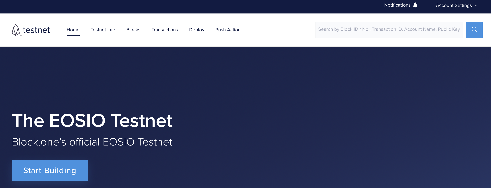
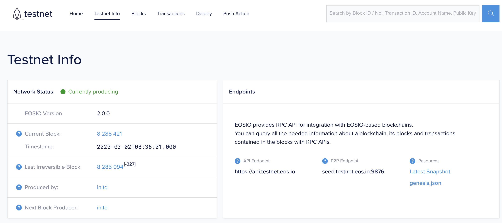
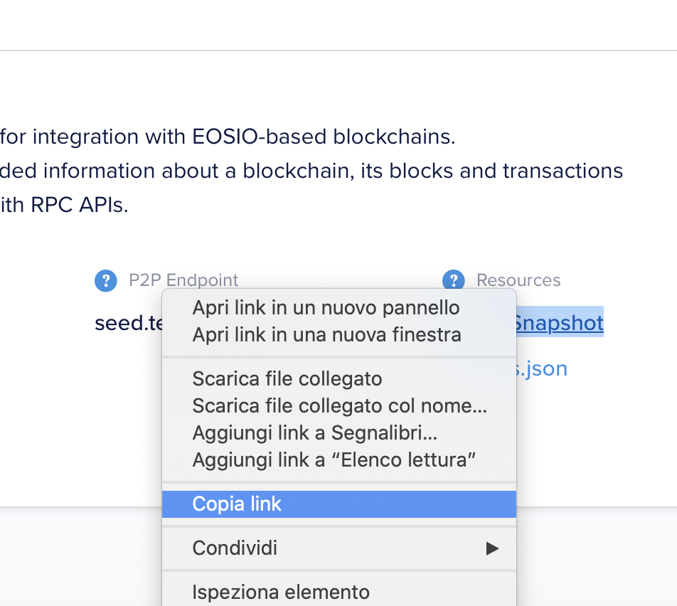

# EOS Docker Node Test Network


## Operating System
The EOSIO software supports the following environments for development and/or deployment:

- Amazon Linux 2
- Centos 7
- Ubuntu 16.04
- Ubuntu 18.04
- MacOS 10.14 (Mojave) and higher

## Run Docker

```
git clone https://github.com/gzileni/eosio.git
cd eosio
docker-compose up
```

## Create Test Account
You have to create account on [The EOSIO Testnet](https://testnet.eos.io)



```
cleos get account <YOUR ACCOUNT>
```

## Download Latest Snapshot



Latest Snapshot contains information about a blockchain, blocks and transactions contained in the blocks.



```
cd snapshots
wget https://snapshot.testnet.eos.io/2020_03_01_15_59_01/snapshots.tar.gz
tar -xf snapshots.tar.gz
```

Modify configuration docker-compose.yml file:

```
.
.
.
nodeosd:
    image: gzileni/eosio:latest
    command: nodeos --config-dir=/opt/eosio/data --data-dir=/opt/eosio/data --snapshot=/opt/eosio/data/snapshots/snapshot-0074af4e936cee1f4ab8b2f468ad42e4d1b026084c6a0c71420df990fc64b4c6.bin --hard-replay-blockchain --delete-all-blocks
.
.
.
```  