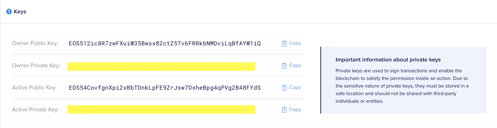

# EOS Docker Node Test Network


## Operating System
The EOSIO software supports the following environments for development and/or deployment:

- Amazon Linux 2
- Centos 7
- Ubuntu 16.04
- Ubuntu 18.04
- MacOS 10.14 (Mojave) and higher

## Run Docker

```
git clone https://github.com/gzileni/eosio.git
cd eosio
docker-compose up
```

## Create Test Account
You have to create account on [The EOSIO Testnet](https://testnet.eos.io)


## Create Development Enviroment

First follow instructions about to [Create Development Wallet](https://developers.eos.io/welcome/latest/getting-started/development-environment/create-development-wallet)

### Create Development Account  


